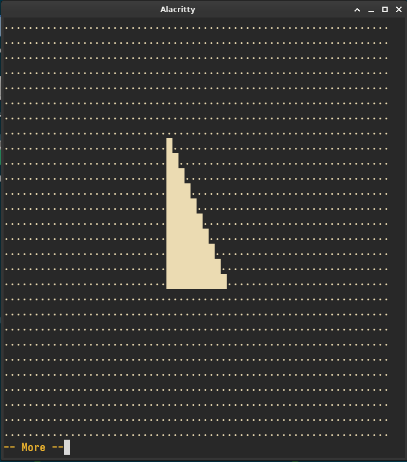

# About
Simple algorithm that decodes `uint64_t` numbers into pixels, treating each individual bit as "pixel on" or "pixel off" and renders it directly into the terminal *stdout*.
> [!NOTE]
> This decoder was made to optimize the current `boolean` pixel representation of [Chip-8 Emulator](https://github.com/sircaffe/chip8emu)
### Try it out
```shell
$ ./build.pl
$ ./a.out
```
### Demo

